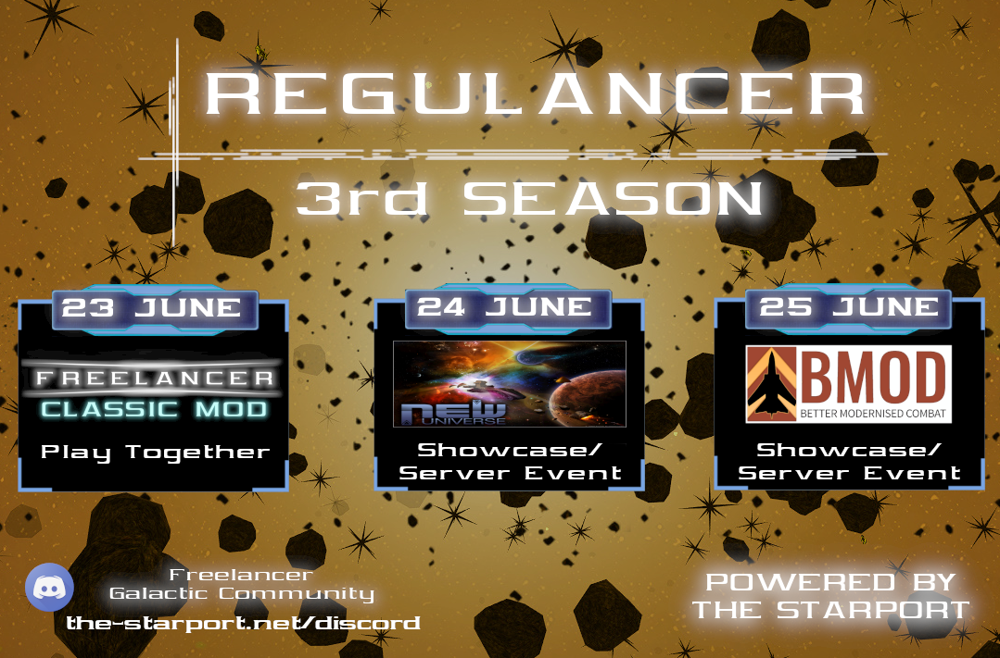

# Regulancer: Season 3

Greetings Freelancers!
I'm happy to announce the 3rd Season of "Regulancer" powered by Starport and the Freelancer Galactic Community. 

In the 3rd Season, we will see some showcases of New Universe and BMOD (Better Modernised Combat Mod). The new special Event will be a Classic Mod Day where the Hoster will start a temporary server of an old classic Mod.

More information will follow in the next weeks. stay tuned for more!

## What is Regulancer?
  
Regulancer is an event series that takes place every last weekend of the month. in this series, mods and projects related to the topic of Freelancer can present themselves during a showcase event or can prepare a server event for a call of playing together. These events are also streamed live on the platforms Youtube or Twitch so that everyone has the opportunity to be there.

# Schedule

 - **23rd of June**
     - *Freelancer Classic Mod Event*
     - Hosted by **XxSARGExX979** & **BC46**
     - Streamlink: [XxSARGExX979´s Twitch Channel](https://www.twitch.tv/dedarkstar)
 - **24th of June**
     - *Freelancer New Universe Showcase Event*
     - Hosted by "**Takashi**"
     - Streamlink: [Takashi´s Twitch Channel](https://www.twitch.tv/drctakashi)
 - **25th of June**
     - *Freelancer BMOD Showcase Event*
     - Hosted by "**Beagle**"
     - Streamlink: [Beagle´s Twitch Channel](https://www.twitch.tv/beagsandjam)

Detailed information about time and topics will follow in a few weeks, you can also join the [Starport Community Discord Server](https://discord.com/invite/c6wtsBk) for more information.

