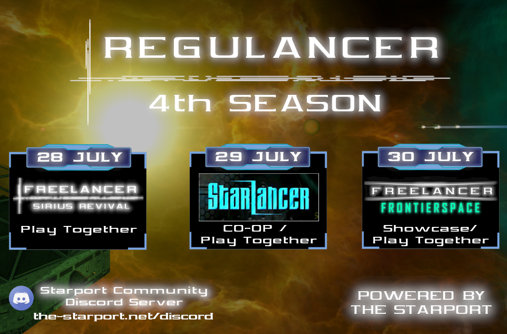

# REGULANCER SEASON 4

Greetings Freelancers!
I'm happy to announce the 4th Season of "Regulancer" powered by The Starport. 

For some of our members, the summer has reached its peak and not only the temperatures are at a record high, but the event team also presents you with another action-packed Regulancer weekend, Look forward to being part of the following events hosted by cool members of our community:

- Freelancer Sirius Revival
- Starlancer
- Freelancer Frontierspace (Classic Mod)

More information will follow in the next weeks. Stay tuned for more!

## What is Regulancer?
  
Regulancer is an event series that takes place every last weekend of the month. in this series, mods and projects related to the topic of Freelancer can present themselves during a showcase event or can prepare a server event for a call of playing together. These events are also streamed live on the platforms Youtube or Twitch so that everyone has the opportunity to be there.

# Schedule

 - **28th of July**
   - ***Freelancer Sirius Revival***
   - Hosted by "**Skotty**"
   - Streamlink: [Skotty´s Twitch Channel](https://www.twitch.tv/skotty__)
 - **29th of July**
   - ***STARLANCER***
   - Hosted by "**XxSARGExX979**" & "**SnakeLancer**"
   - Streamlink: [XxSARGExX979´s Twitch Channel](https://www.twitch.tv/dedarkstar)
   - Streamlink: [SnakeLancer´s Twitch Channel](https://www.twitch.tv/snakelancerhaven)
 - **30th of July**
   - **Freelancer Frontierspace** 
   - Hosted by "**XxSARGExX979**"
   - Streamlink: [XxSARGExX979´s Twitch Channel](https://www.twitch.tv/dedarkstar)

Detailed information about time and topics will follow in a few weeks, you can also join the The Starport Discord for more information: [The Starport Discord Server](https://discord.com/invite/c6wtsBk)

