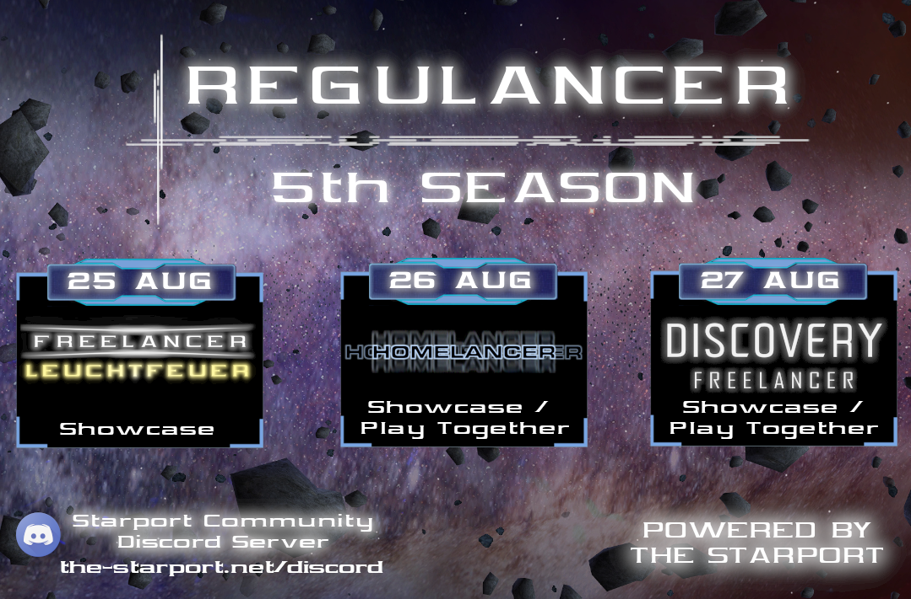

# REGULANCER SEASON 5

Greetings Freelancers!
The 4th Regulancer season has just ended and the 5th season is already in the starting blocks.

For August we have something special for you again!

Starting with the showcase of the so-called "Leuchtfeuer" mod created by Cpt. Rei Fukai followed by another showcase and play together event of "Homelancer" created by Volken. the finale of this Season will be a showcase of the upcoming and bigger Freelancer Discovery update.
 
Look forward to old friends and a completely new total conversion mod

- Freelancer Leuchtfeuer
- Homelancer
- Freelancer Discovery

More information will follow in the next weeks. stay tuned for more!

## What is Regulancer?
  
Regulancer is an event series that takes place every last weekend of the month. In this series, mods and projects related to the topic of Freelancer can present themselves during a showcase event or can prepare a server event for a call of playing together. These events are also streamed live on the platforms Youtube or Twitch so that everyone has the opportunity to be there.

# Schedule

 - **25th of August**
	 - ***Freelancer Leuchtfeuer***
	 - Hosted by "**Cpt. Rei Fukai**" & "**XxSARGExX979**"
	 - Streamlink: [XxSARGExX´s Twitch Channel](https://www.twitch.tv/dedarkstar)
 - **26th of August**
	 - ***Homelancer***
	 - Hosted by "**Volken**" & "**XxSARGExX979**"
	 - Streamlink: [XxSARGExX979´s Twitch Channel](https://www.twitch.tv/dedarkstar)
 - **27th of August**
	 - **Freelancer Discovery** 
	 - Hosted by "**Haste**" &  "**XxSARGExX979**"
	 - Streamlink: [XxSARGExX979´s Twitch Channel](https://www.twitch.tv/dedarkstar)

Detailed information about times and topics will follow in a few weeks, you can also join the The Starport Discord for more information:  [The Starport Discord Server](https://discord.com/invite/c6wtsBk)

