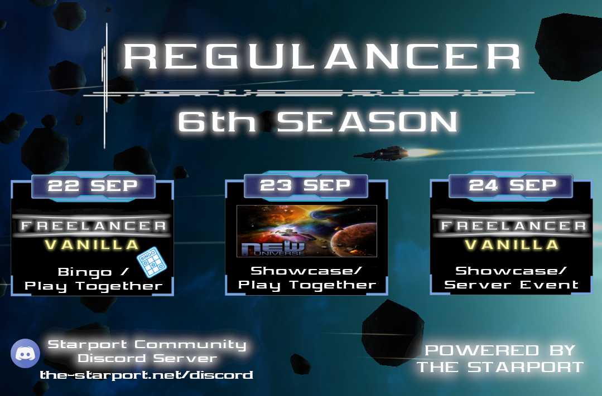

# REGULANCER SEASON 6

Greetings Freelancers!

I am presenting you the 2023 September season of Regulancer, we're already at the 6th season of this series and I say thank you to everyone who attended and supported this series of events so far.

This time, you can attend the Freelancer vanilla bingo event on Zoner Universe, see the far frontier of the New Universe Mod, or fight to be the first pirate to reach level 30 in Sirius.

Looking forward to seeing you in space Freelancers!

More information will follow in the next weeks. stay tuned for more!

## What is Regulancer?
  
Regulancer is an event series that takes place every last weekend of the month. In this series, mods and projects related to the topic of Freelancer can present themselves during a showcase event or can prepare a server event for a call of playing together. These events are also streamed live on the platforms Youtube or Twitch so that everyone has the opportunity to be there.

# Shedule

 - **22nd of September**
	 - ***Freelancer Vanilla Bingo***
	 - Hosted by **Abscond**
	 - Streamlink: [Abscond´s Twitch Channel](https://www.twitch.tv/abscondpt)
 - **23rd of September**
	 - ***Freelancer New Universe***
	 - Hosted by "**Takashi**"
	 - Streamlink: [Takashi´s Twitch Channel](https://www.twitch.tv/drctakashi)
 - **24th of September**
	 - **Freelancer Vanilla Pirate Race** 
	 - Hosted by "**Raikkonen**"
	 - Streamlink: [Skotty´s Twitch Channel](https://www.twitch.tv/skotty__)

Detailed information about time and topics will follow in a few weeks, you can also join the Starport Discord for more information:  [The Starport Discord Server](https://discord.com/invite/c6wtsBk)

