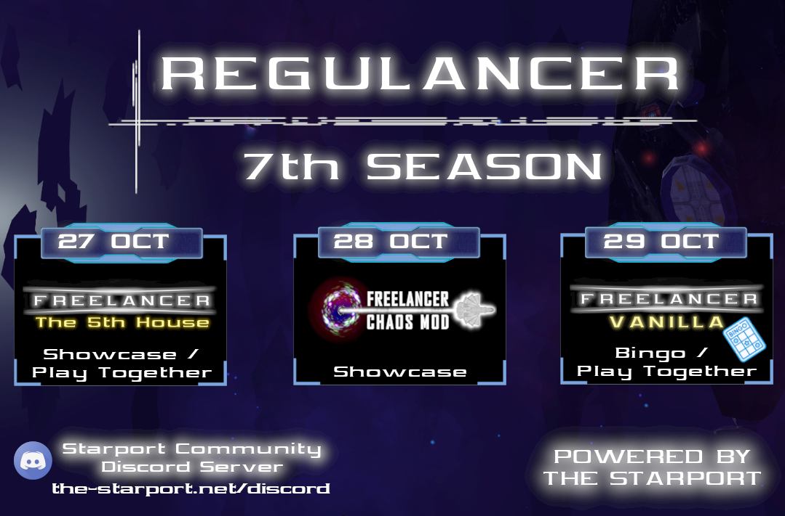

# REGULANCER SEASON 7

Hi all,

I am pleased to announce the 7th season of Regulancer. We have it all this time:

- An old mod
- A new mod
- Vanilla

Reminders will be posted closer to the time. 

Good luck out there!

## What is Regulancer?
  
Regulancer is an event series that takes place every last weekend of the month. In this series, mods and projects related to the topic of Freelancer can present themselves during a showcase event or can prepare a server event for a call of playing together. These events are also streamed live on the platforms Youtube or Twitch so that everyone has the opportunity to be there.

# Schedule

 - **27th of October**
	 - ***Freelancer 5th House***
	 - Hosted by **Skotty**
	 - Streamlink: [Skotty's Twitch Channel](https://www.twitch.tv/skotty__)
 - **28th of October**
	 - ***Freelancer Chaos Mod***
	 - Hosted by **Laz**
	 - Streamlink: [Laz's Twitch Channel](https://www.twitch.tv/wingsoflazrius)
 - **29th of October**
	 - **Freelancer Vanilla Bingo** 
	 - Hosted by **Abscond**
	 - Streamlink: [Abscond's Twitch Channel](https://www.twitch.tv/abscondpt)

Detailed information about time and topics will follow in a few weeks, you can also join the Starport Discord for more information:  [The Starport Discord Server](https://discord.com/invite/c6wtsBk)

