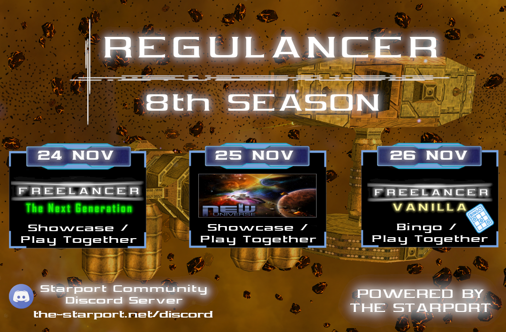

# REGULANCER SEASON 8

Greetings Freelancers!
I'm happy to announce the 8th and last Regulancer Season for this year. 

With the holidays falling on the usual Regulancer next month, the November Regulancer is the culmination of an eventful year full of community events.

But the 8th November Season is far from boring, with The Next Generation we have another classic mod for this weekend as well as an exciting Freelancer New Universe Showcase and Playtogether and last but not least, another Freelancer Bingo Season 

## What is Regulancer?
  
Regulancer is an event series that takes place every last weekend of the month. in this series, mods and projects related to the topic of Freelancer can present themselves during a showcase event or can prepare a server event for a call of playing together. These events are also streamed live on the platforms Youtube or Twitch so that everyone has the opportunity to be there.

# Shedule

 - **24th of November**
	 - ***Freelancer TNG Mod***
	 - Hosted by **Skotty**
	 - Streamlink: [Skotty´s Twitch Channel](https://www.twitch.tv/skotty__)
 - **25th of November**
	 - ***Freelancer New Universe Mod***
	 - Hosted by "**Takashi**"
	 - Streamlink: [Takashi´s Twitch Channel](https://www.twitch.tv/drctakashi)
 - **26th of November**
	 - **Freelancer Vanilla Bingo Event** 
	 - Hosted by "**Abscond**"
	 - Streamlink: [Abscond´s Twitch Channel](https://www.twitch.tv/abscondpt)

Detailed information about time and topics will follow in a few weeks, you can also join the Starport Discord for more information: [The Starport Discord Server](https://the-starport.net/discord)

