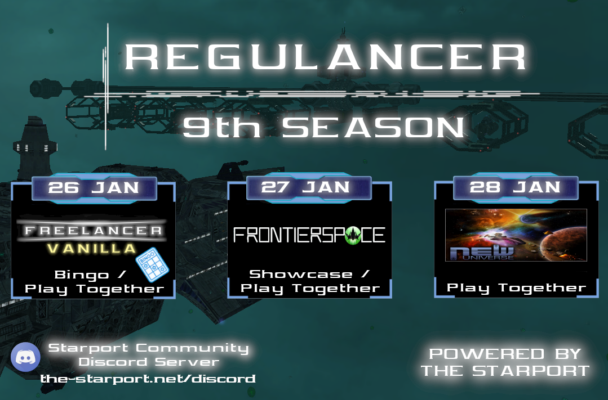

# REGULANCER SEASON 9

Happy New Year Freelancers!

After the Holiday break, the 9th Season is ready to go!
We're starting this year with a bingo event and discovering the secrets of Frontierspace, followed by New Universe with its server event. Stay tuned!

Looking forward to seeing you in space Freelancer.

More information will follow in the next weeks. stay tuned for more!

## What is Regulancer?
  
Regulancer is an event series that takes place every last weekend of the month. in this series, mods and projects related to the topic of Freelancer can present themselves during a showcase event or can prepare a server event for a call of playing together. These events are also streamed live on the platforms YouTube or Twitch so that everyone has the opportunity to be there.

# Schedule

 - **23rd of January**
	 - ***Freelancer Vanilla Bingo***
	 - Hosted by **Abscond**
	 - Stream link: [Abscond´s Twitch Channel](https://www.twitch.tv/abscondpt)
 - **24th of January**
	 - ***Freelancer Frontierspace***
	 - Hosted by "**Stratobrick**"
	 - Stream link: TBA
 - **25th of January**
	 - **Freelancer New Universe** 
	 - Hosted by "**Takashi**"
	 - Stream link: [Takashi´s Twitch Channel](https://www.twitch.tv/drctakashi)

Detailed information about time and topics will follow in a few weeks, you can also join the Starport Discord for more information:  [The Starport Discord Server](https://discord.com/invite/c6wtsBk)

